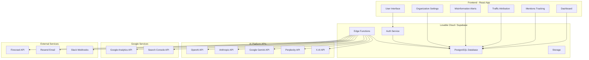
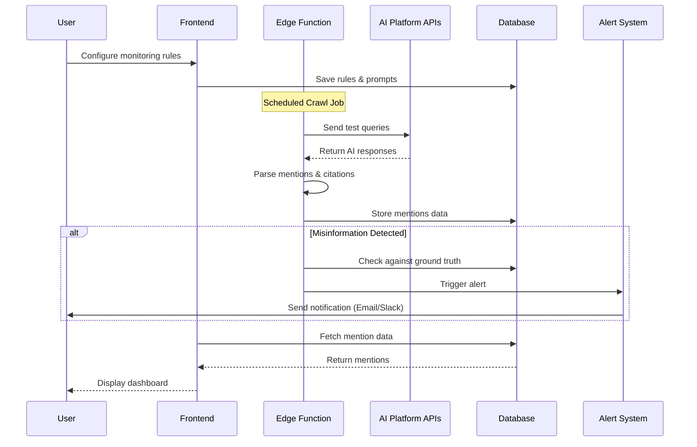
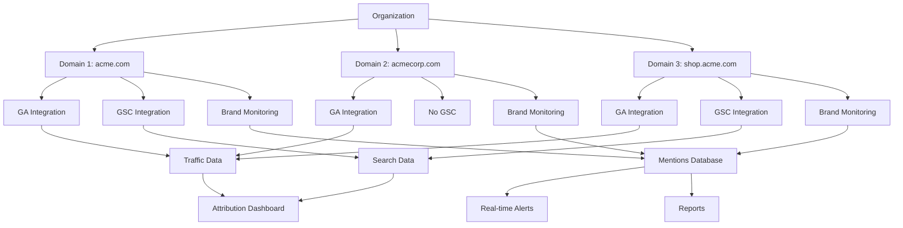
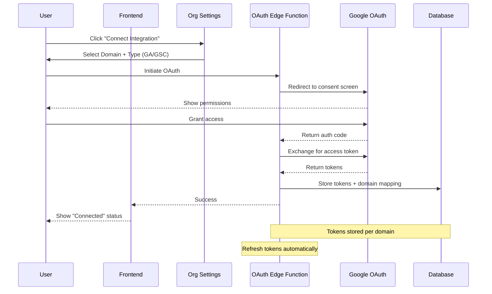
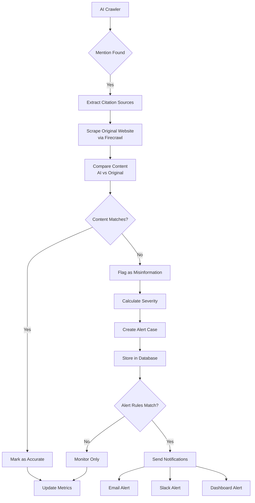
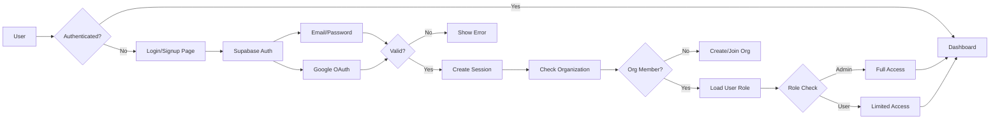
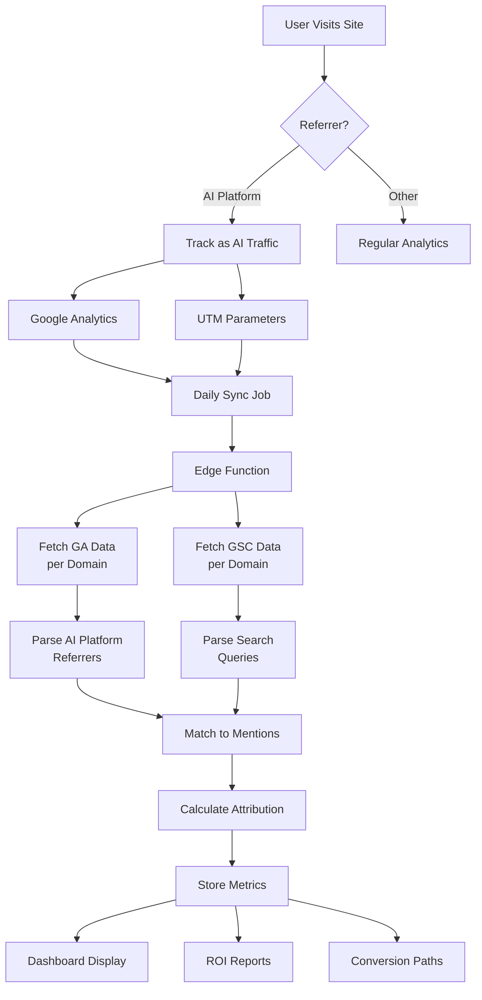
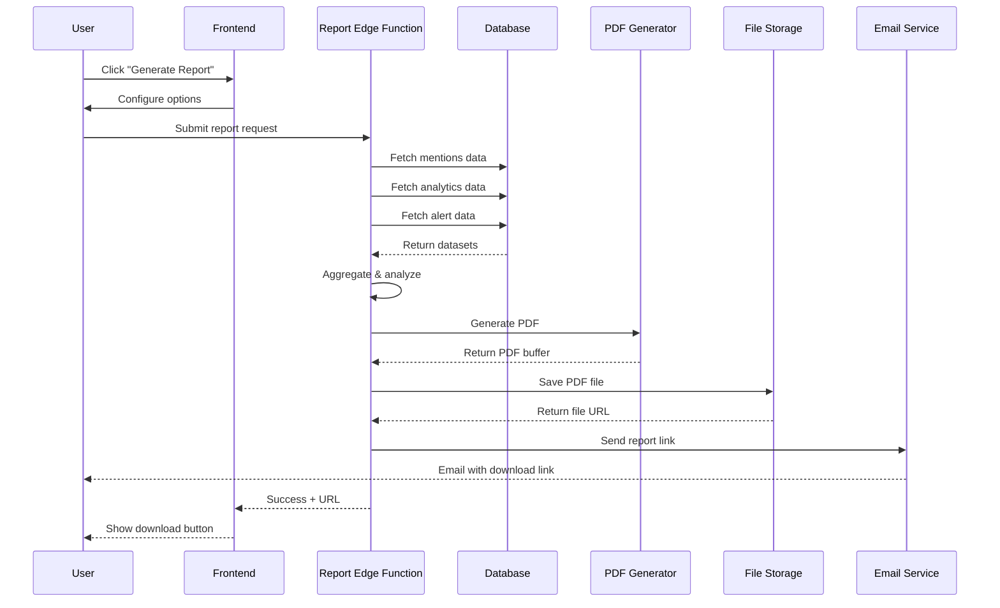
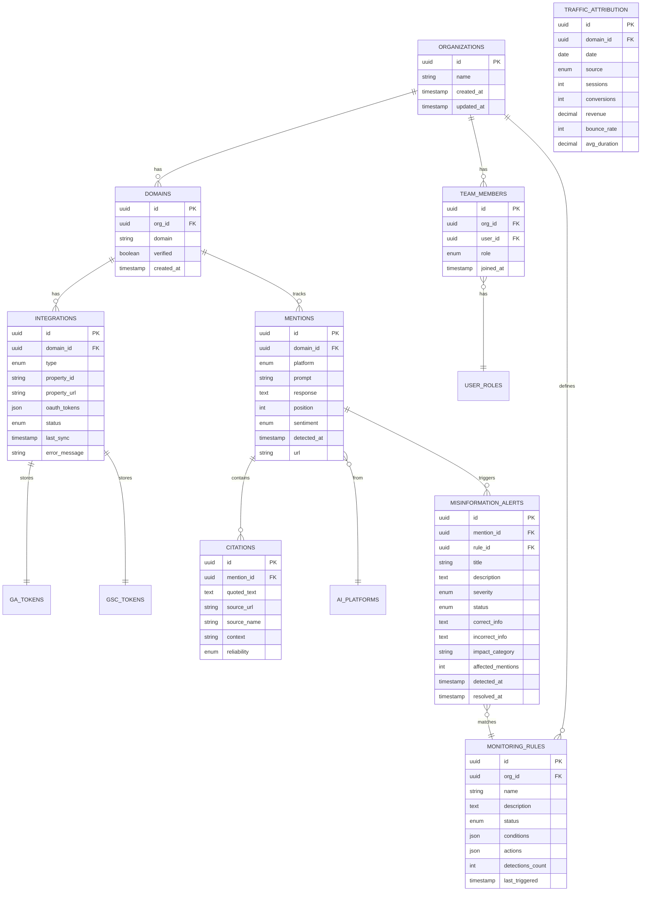

# AI Visibility Pro - Architecture & Flow Diagrams

## Table of Contents
1. [System Architecture Overview](#system-architecture-overview)
2. [AI Mention Tracking Flow](#ai-mention-tracking-flow)
3. [Multi-Tenant Domain & Integration Flow](#multi-tenant-domain--integration-flow)
4. [Google OAuth Integration Flow](#google-oauth-integration-flow)
5. [Misinformation Detection & Correction Flow](#misinformation-detection--correction-flow)
6. [User Authentication & Authorization Flow](#user-authentication--authorization-flow)
7. [Traffic Attribution Data Pipeline](#traffic-attribution-data-pipeline)
8. [Report Generation Flow](#report-generation-flow)
9. [Data Models & Database Schema](#data-models--database-schema)

---

## System Architecture Overview



### Architecture Components:

**Frontend Layer:**
- React 18 with TypeScript
- React Router for navigation
- Tanstack Query for data fetching
- Shadcn/ui component library
- Tailwind CSS for styling

**Backend Layer:**
- Supabase (PostgreSQL database)
- Supabase Auth (authentication)
- Supabase Edge Functions (serverless)
- Supabase Storage (file storage)

**External Integrations:**
- AI Platform APIs (OpenAI, Anthropic, Google, Perplexity, X.AI)
- Google Analytics & Search Console APIs
- Firecrawl (web scraping)
- Resend (email service)
- Slack (notifications)

---

## AI Mention Tracking Flow



### Process Steps:

1. **Configuration Phase:**
   - User sets up monitoring rules in Organization Settings
   - Defines target prompts/queries to monitor
   - Selects AI platforms to track
   - Frontend saves configuration to database

2. **Crawling Phase (Automated):**
   - Edge function runs on schedule (hourly/daily)
   - Sends test queries to each AI platform API
   - Receives AI-generated responses
   - Parses responses for brand mentions
   - Extracts citation sources and URLs

3. **Analysis Phase:**
   - Compare AI response with ground truth (website content)
   - Identify sentiment (positive/neutral/negative)
   - Calculate position ranking
   - Detect potential misinformation

4. **Storage Phase:**
   - Store mention data in database
   - Link citations to original sources
   - Track metrics over time

5. **Alerting Phase:**
   - If misinformation detected, trigger alert
   - Send notifications via configured channels
   - Create action items for review

6. **Display Phase:**
   - Frontend fetches latest mentions
   - Display in real-time dashboard
   - Show trends and analytics

---

## Multi-Tenant Domain & Integration Flow



### Multi-Tenancy Structure:

**Organization Level:**
- Single billing entity
- Multiple team members with roles (Admin/User)
- Shared monitoring rules and alert configurations
- Consolidated reporting across all domains

**Domain Level:**
- Each domain has separate:
  - Google Analytics integration (OAuth tokens)
  - Google Search Console integration (OAuth tokens)
  - Brand monitoring configuration
  - Traffic attribution tracking

**Data Isolation:**
- Mentions tracked per domain
- Analytics data separated by domain
- Reports can be generated per domain or consolidated
- RLS policies ensure data access control

**Benefits:**
- Track multiple brands/websites under one account
- Compare performance across domains
- Centralized team management
- Consolidated billing

---

## Google OAuth Integration Flow



### OAuth Setup Requirements:

**Google Cloud Console Setup:**
1. Create project in Google Cloud Console
2. Enable APIs:
   - Google Analytics Data API (v1)
   - Google Analytics Admin API (v1)
   - Google Search Console API
3. Create OAuth 2.0 credentials:
   - Application type: Web application
   - Authorized JavaScript origins: `https://your-domain.lovable.app`
   - Authorized redirect URIs: `https://your-domain.lovable.app/auth/callback`

**Required OAuth Scopes:**
```
https://www.googleapis.com/auth/analytics.readonly
https://www.googleapis.com/auth/webmasters.readonly
```

**Token Storage:**
- Access tokens (expires in 1 hour)
- Refresh tokens (long-lived)
- Token expiry timestamp
- Associated domain ID
- Encrypted in database

**Token Refresh Logic:**
- Check expiry before each API call
- Automatic refresh using refresh token
- Update stored tokens in database
- Handle refresh failures (re-authentication needed)

---

## Misinformation Detection & Correction Flow



### Detection Process:

**Step 1: Content Extraction**
- AI crawler finds brand mention
- Extract cited sources from AI response
- Identify URLs being referenced
- Parse quoted text and context

**Step 2: Ground Truth Verification**
- Use Firecrawl API to scrape original website
- Extract relevant sections cited by AI
- Convert to structured format (markdown)

**Step 3: Semantic Comparison**
- Use Lovable AI (Gemini 2.5 Flash) for comparison
- Compare AI's interpretation vs original content
- Identify factual discrepancies
- Check for:
  - Incorrect product specs
  - Wrong pricing information
  - Outdated company data
  - Misattributed quotes
  - False claims

**Step 4: Severity Assessment**
```
HIGH: Critical business impact (pricing, safety, legal)
MEDIUM: Important but not urgent (company history, features)
LOW: Minor inaccuracies (formatting, non-critical details)
```

**Step 5: Alert Creation**
- Create misinformation alert case
- Assign severity level
- Calculate affected mention count
- Determine impact category:
  - Product Information
  - Company History
  - Pricing & Sales
  - Brand Reputation
  - Leadership & Quotes

**Step 6: Notification Routing**
- Check if alert matches monitoring rules
- Route to appropriate notification channels
- Include:
  - Incorrect information
  - Correct information
  - AI platform source
  - Number of affected mentions
  - Recommended action

**Step 7: Action Tracking**
- Log alert in database with status: `investigating`
- Track resolution progress:
  - `investigating` → `correcting` → `monitoring` → `verified`
- Measure time to resolution
- Track correction verification

---

## User Authentication & Authorization Flow



### Authentication Methods:

**1. Email/Password:**
- Standard Supabase Auth
- Email verification enabled
- Password requirements:
  - Minimum 8 characters
  - At least one uppercase letter
  - At least one number
  - At least one special character

**2. Google OAuth (Optional):**
- OAuth 2.0 flow
- Single sign-on
- Profile data sync
- No password required

### Authorization Levels:

**Admin Role:**
- Full access to all features
- Manage organization settings
- Add/remove team members
- Configure integrations (GA, GSC)
- View all domains and data
- Create and edit monitoring rules
- Access billing and subscription
- Export all reports

**User Role:**
- View mentions and analytics
- Create personal reports
- View alerts and notifications
- Cannot modify organization settings
- Cannot manage team members
- Cannot configure integrations
- Read-only access to monitoring rules

### Row-Level Security (RLS):

Database policies enforce access control:
```sql
-- Users can only access their organization's data
CREATE POLICY "Users access own org data"
ON mentions FOR SELECT
USING (
  domain_id IN (
    SELECT d.id FROM domains d
    JOIN organization_members om ON om.org_id = d.org_id
    WHERE om.user_id = auth.uid()
  )
);

-- Only admins can modify organization settings
CREATE POLICY "Admins manage org"
ON organizations FOR UPDATE
USING (
  EXISTS (
    SELECT 1 FROM organization_members
    WHERE org_id = organizations.id
    AND user_id = auth.uid()
    AND role = 'admin'
  )
);
```

---

## Traffic Attribution Data Pipeline



### Attribution Tracking:

**Step 1: Traffic Identification**

AI Platform referrers detected:
- `chat.openai.com`
- `claude.ai`
- `gemini.google.com`
- `perplexity.ai`
- `grok.x.ai`

UTM parameters recommended:
```
utm_source=chatgpt
utm_medium=ai_referral
utm_campaign=brand_mention
```

**Step 2: Data Collection**

Google Analytics metrics collected:
- Sessions by source
- Page views
- Bounce rate
- Average session duration
- Goal completions/conversions
- Revenue (if e-commerce enabled)
- Device breakdown
- Geographic distribution

Google Search Console metrics:
- Search queries leading to AI mentions
- Impressions
- Clicks
- CTR (Click-through rate)
- Average position

**Step 3: Data Synchronization**

Sync frequency: Daily at 2:00 AM UTC
- Edge function calls GA API per domain
- Fetch previous day's data
- Store in `traffic_attribution` table
- Update aggregated metrics

**Step 4: Attribution Matching**

Link traffic to mentions:
- Match referrer to AI platform
- Correlate time window (mention → visit)
- Track conversion paths
- Calculate attribution models:
  - First touch (first AI mention)
  - Last touch (most recent mention)
  - Linear (equal credit)
  - Time decay (recent weighted higher)

**Step 5: ROI Calculation**

```
ROI = (Revenue from AI Traffic - Cost of AI Visibility) / Cost × 100%

Where:
- Revenue = Conversions × Average Order Value
- Cost = Subscription + API costs + Marketing spend
```

**Step 6: Reporting**

Traffic Attribution Dashboard shows:
- Total visits from AI platforms
- Conversion rate by platform
- Revenue generated
- Top conversion paths
- Device and geo breakdown
- Landing page performance
- Trend analysis over time

---

## Report Generation Flow



### Report Types:

**1. Executive Summary Report**
- High-level KPIs
- Visibility score trends
- Top performing platforms
- Key recommendations
- 2-page PDF

**2. Detailed Analytics Report**
- All mentions with details
- Citation analysis
- Sentiment breakdown
- Competitor comparison
- Traffic attribution
- 10-20 page PDF

**3. Misinformation Report**
- Active alert cases
- Resolved cases
- Response times
- Impact analysis
- Corrective actions taken
- 5-10 page PDF

**4. Traffic Attribution Report**
- AI platform traffic breakdown
- Conversion paths
- ROI calculation
- Device and geo data
- Landing page analysis
- 8-15 page PDF

### Report Generation Process:

**Configuration:**
- Select report type
- Choose date range
- Select domains (single or all)
- Choose format (PDF or CSV)
- Schedule (one-time or recurring)

**Data Aggregation:**
- Query database for relevant data
- Calculate metrics and KPIs
- Generate charts and graphs
- Prepare executive summary

**PDF Generation:**
- Use Puppeteer in Edge Function
- Render HTML template
- Apply branding and styling
- Include charts and tables
- Optimize for print and digital

**Delivery:**
- Save to Supabase Storage
- Generate download link (expires in 7 days)
- Send email notification with link
- Display in Reports dashboard
- Allow re-download from history

**Scheduling:**
- Weekly reports: Every Monday at 9 AM
- Monthly reports: 1st of month at 9 AM
- Custom schedules available
- Automatic email delivery

---

## Data Models & Database Schema



### Core Tables:

**organizations**
- Central tenant entity
- Owns all domains and data
- Billing and subscription linked here

**domains**
- Website domains to track
- Can have multiple per organization
- Each has separate integrations

**integrations**
- Google Analytics connections
- Google Search Console connections
- OAuth tokens stored encrypted
- Status tracking (active/error)

**mentions**
- Core tracking entity
- Stores AI platform responses
- Links to citations and alerts
- Sentiment and position tracked

**citations**
- Source references from AI responses
- URL and quoted text
- Reliability scoring
- Used for verification

**misinformation_alerts**
- Flagged inaccuracies
- Links to mentions and rules
- Status tracking through resolution
- Impact assessment

**monitoring_rules**
- User-defined detection rules
- Condition matching logic
- Automated action triggers
- Performance tracking

**team_members**
- Organization membership
- Role-based access control
- User profile linkage

**traffic_attribution**
- Daily aggregated analytics
- Source breakdown
- Conversion tracking
- ROI calculation basis

### Indexing Strategy:

```sql
-- High-frequency queries
CREATE INDEX idx_mentions_domain_date ON mentions(domain_id, detected_at DESC);
CREATE INDEX idx_mentions_platform ON mentions(platform);
CREATE INDEX idx_citations_mention ON citations(mention_id);
CREATE INDEX idx_alerts_status ON misinformation_alerts(status, detected_at DESC);

-- Multi-tenant queries
CREATE INDEX idx_domains_org ON domains(org_id);
CREATE INDEX idx_team_members_org ON team_members(org_id);
CREATE INDEX idx_team_members_user ON team_members(user_id);

-- Analytics queries
CREATE INDEX idx_traffic_domain_date ON traffic_attribution(domain_id, date DESC);
```

### RLS Policies:

All tables have Row-Level Security enabled to enforce multi-tenancy:

```sql
-- Example: Mentions table RLS
ALTER TABLE mentions ENABLE ROW LEVEL SECURITY;

CREATE POLICY "Users see their org's mentions"
ON mentions FOR SELECT
USING (
  domain_id IN (
    SELECT d.id FROM domains d
    JOIN team_members tm ON tm.org_id = d.org_id
    WHERE tm.user_id = auth.uid()
  )
);

CREATE POLICY "Users insert mentions for their domains"
ON mentions FOR INSERT
WITH CHECK (
  domain_id IN (
    SELECT d.id FROM domains d
    JOIN team_members tm ON tm.org_id = d.org_id
    WHERE tm.user_id = auth.uid()
  )
);
```

---

## Conclusion

This architecture provides:
- **Scalability**: Multi-tenant design supports unlimited organizations
- **Security**: RLS policies and OAuth token encryption
- **Reliability**: Automated syncs with error handling
- **Flexibility**: Configurable rules and integrations
- **Insights**: Comprehensive analytics and reporting
- **Automation**: Scheduled jobs for continuous monitoring

The modular design allows for easy extension with new AI platforms, analytics sources, and notification channels as the product evolves.
